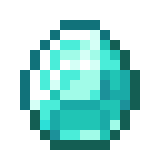
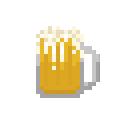
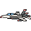

# INFO2056-Premier-Projet-Informatique

Pour lancer, faite soit:
- make
- python3 src/init.py

# Aide

## Industries
 
| Industry Name                     | Input Ressource                   | Output Ressource      |
| --------------------------------- | --------------------------------- | --------------------- |
| Fishing Boat                      | -                                 | Fish                  |
| Salt Extraction                   | -                                 | Salt                  |
| Wheat                             | -                                 | Wheat                 |
| Potato                            | -                                 | Potato                |
| Cotton                            | -                                 | Cotton                |
| Rice                              | -                                 | Rice                  |
| Fur Hunting Grounds               | -                                 | Fur                   |
| Lumbermill                        | -                                 | Wood                  |
| Sand Query                        | -                                 | Sand                  |
| Stone Query                       | -                                 | Stone                 |
| Oil Well                          | -                                 | Oil                   |
| Coal Mine                         | -                                 | Coal                  |
| Iron Mine                         | -                                 | Iron                  |
| Copper Mine                       | -                                 | Copper                |
| Precious Metal Mine               | -                                 | Precious Metal        |
| Rare Metal Mine                   | -                                 | Rare Metal            |
| Bread Factory                     | Wheat                             | Bread                 |
| Alcohol Factory                   | Potato                            | Alcohol               |
| Sushi Factory                     | Rice Salt Fish              | Sushi                 |
| Textile Factory                   | Cotton                            | Textile               |
| Clothes Factory                   | Textile                           | Clothes               |
| Furniture Factory                 | Wood Iron                      | Furniture             |
| Steel mill                        | Iron Coal                      | Steel                 |
| Tooling Factory                   | Steel Wood                     | Tools                 |
| Cement Factory                    | Stone Sand                     | Cement                |
| Refinary                          | Oil                               | Fuel                  |
| Plastic Factory                   | Fuel                              | Plastic               |
| Glass Factory                     | Sand                              | Glass                 |
| Electronic Components(EC) Factory | Copper Rare Metals             | Electronics Component |
| Radio Factory                     | Copper Steel                   | Radio                 |
| Computer Factory                  | EC Steel                       | Computer              |
| Gun Factory                       | Steel                             | Guns                  |
| Engine Factory                    | Steel Fuel                     | Engine                |
| Car Factory                       | Steel Engine Glass          | Car                   |
| Planes Factory                    | Radio Steel Glass Engine | Planes                |
| Jewelry Workshop                  | Precious Metals                   | Jewelry               |
| Phone Factory                     | Computer Plastic Glass      | Phone                 |

## Goods

| Name                  | Image                                                                                               |
| --------------------- | --------------------------------------------------------------------------------------------------- |
| Fish                  |  |
| Salt                  |  |
| Wheat                 |  |
| Potato                |  |
| Cotton                |  |
| Rice                  |  |
| Fur                   |  |
| Wood                  |  |
| Sand                  |  |
| Stone                 |  |
| Oil                   |  |
| Coal                  |  |
| Iron                  |  |
| Copper                |  |
| Precious Metal        |  |
| Rare Metal            |  |
| Bread                 |  |
| Alcohol               |  |
| Sushi                 |  |
| Textile               |  |
| Clothes               |  |
| Furniture             |  |
| Steel                 |  |
| Tools                 |  |
| Cement                |  |
| Fuel                  |  |
| Plastic               |  |
| Glass                 |  |
| Electronics Component |  |
| Radio                 |  |
| Computer              |  |
| Guns                  |  |
| Engine                |  |
| Car                   |  |
| Planes                |  |
| Jewelry               |  |
| Phone                 |  |

## Terrain Tiles

| Terrain Tile Type | Spawned Ressources                      |
| ----------------- | --------------------------------------- |
| Deep Sea          | Fish Oil                             |
| Shallow Sea       | Fish                                    |
| Beach             | Sand Oil Salt                     |
| Plains            | Fertile Land                            |
| Forest            | Wood Hunting Grouds                  |
| Hills             | Coal Iron Copper Stone         |
| Mountains         | Iron Precious Metals Rare Metals  |

## Ressources

|                                                                            | Ressources type | Industry                   |
| -------------------------------------------------------------------------- | --------------- | -------------------------- |
|  | Fish            | Fishing Boat               |
|  | Salt            | Salt Extraction            |
|   | Fertile Land    | Carrots Wheat Potato |
|   | Hunting Grouds  | Fur Hunting Grounds        |
|  | Wood            | Lumbermill                 |
|    | Oil             | Oil Well                   |
|  | Coal            | Coal Mine                  |
|  | Iron            | Iron Mine                  |
|  | Copper          | Copper Mine                |
|  | Precious Metals | Precious Metal Mine        |
|  | Rare Metals     | Rare Metal Mine            |
|  | Sand            | Sand Query                 |
|  | Stone           | Stone Query                |
